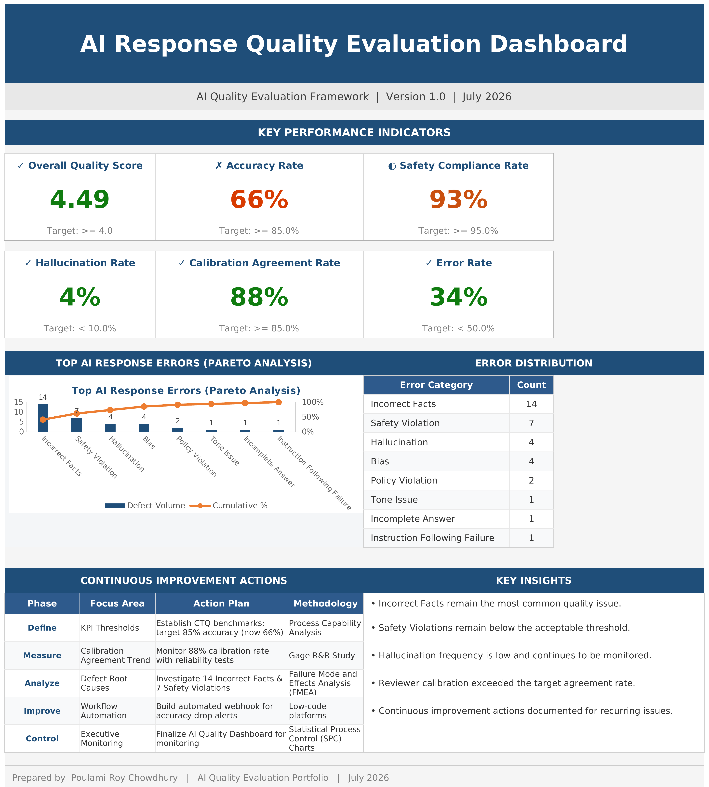
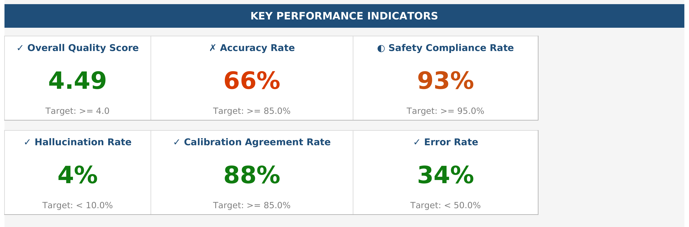
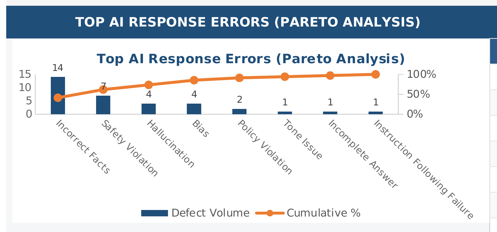
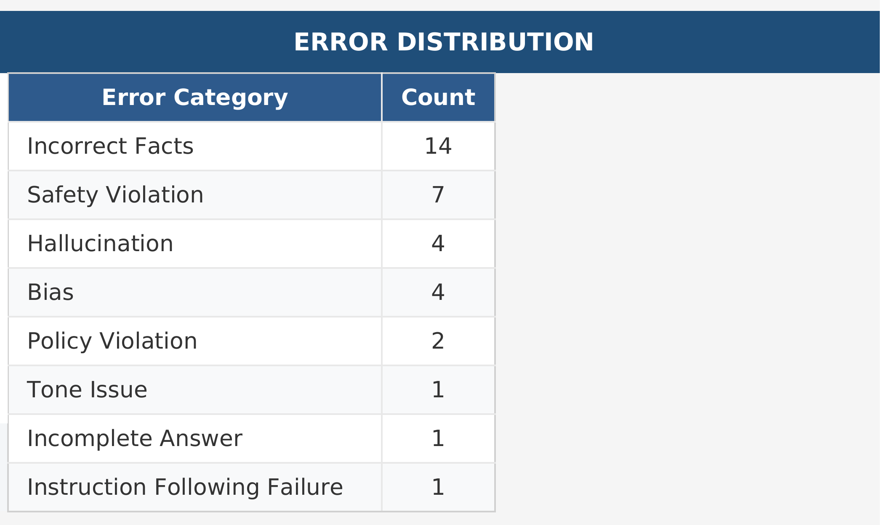
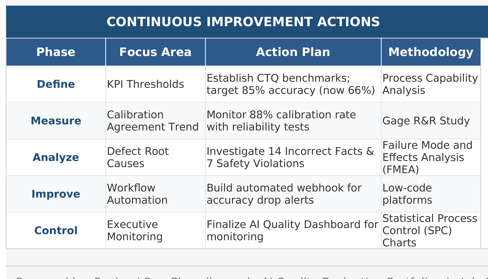

# AI Quality Evaluation Framework for Generative AI Responses

**Enterprise AI Governance | RLHF Evaluation | Annotation Quality | Portfolio Project**



## Enterprise AI Quality Evaluation Portfolio Project

## Project at a Glance

| Metric | Value |
|---|---:|
| Project Stages | 10 |
| Deliverables | 25+ |
| Evaluation Records | 100 |
| Reviewer Calibration Scenarios (RLHF-aligned) | 25 |
| Error Categories | 13 |
| KPI Metrics | 8 defined / 7 on dashboard |

## Project Overview

This repository demonstrates an end-to-end **Enterprise AI Quality Evaluation Framework** for assessing Generative AI responses using standardized evaluation methods, governance practices, reviewer calibration, annotation guidelines, RLHF simulations, quality metrics, and executive reporting.

The project was built as a portfolio to showcase practical capabilities in AI Quality Evaluation, Responsible AI, RLHF, and AI Operations. Rather than focusing on model training, it emphasizes the enterprise processes required to evaluate, monitor, and continuously improve AI-generated responses in a scalable and repeatable manner.

## Business Problem

Organizations need consistent AI evaluation processes, reviewer calibration, hallucination detection, governance documentation, measurable KPIs, and executive dashboards to ensure trustworthy AI outputs. This framework provides a structured approach to standardize quality assessment and support responsible AI adoption.

## Project Objectives

- Standardize AI evaluation
- Improve reviewer consistency
- Build governance
- Design KPIs
- Create dashboards
- Simulate RLHF workflows

## Project Workflow

```text
Project Setup
      ↓
Evaluation Rubric
      ↓
Calibration
      ↓
Error Taxonomy
      ↓
Evaluation Dataset
      ↓
Annotation Guidelines
      ↓
RLHF Simulation
      ↓
Quality Metrics
      ↓
Executive Dashboard
      ↓
Final Reporting
```

## Project Structure

```text
AI_Quality_Evaluation_Framework_Project
│
├── README.md
├── 01_Project_Setup
├── 02_Evaluation_Rubric
├── 03_Calibration_Framework
├── 04_Error_Taxonomy
├── 05_Evaluation_Dataset
├── 06_Annotation_Guidelines
├── 07_RLHF_Simulation
├── 08_Quality_Metrics
├── 09_Dashboard
├── 10_Final_Report
└── 11_Portfolio_Assets
```

## Folder Descriptions

Each folder contains the corresponding project artifacts and documentation:
- **01_Project_Setup** – Charter, scope, timeline, governance, and Quality_Audit_SOP.docx.
- **02_Evaluation_Rubric** – Standardized AI response scoring.
- **03_Calibration_Framework** – Reviewer consistency process (Reviewer_Calibration_Guide.docx, RLHF_Calibration_Report.docx, AI_Reviewer_Calibration_Workbook.xlsx).
- **04_Error_Taxonomy** – 13-category AI error classification.
- **05_Evaluation_Dataset** – 100 evaluated AI responses.
- **06_Annotation_Guidelines** – Annotation guidance is provided by the Enterprise AI Quality Review Handbook (Section 9, Reviewer Guidance); Annotation_QA_Checklist.xlsx is the operational QA checklist.
- **07_RLHF_Simulation** – Pairwise RLHF reviewer guidance (RLHF_Reviewer_Guide.docx) and 25 reviewer calibration scenarios (Reviewer_Calibration_Scenarios.xlsx).
- **08_Quality_Metrics** – KPI definitions and measurement framework.
- **09_Dashboard** – Executive dashboard and charts.
- **10_Final_Report** – Complete documentation and presentation.
- **11_Portfolio_Assets** – Images, screenshots, and portfolio graphics.

> **Note on Annotation Guidance:** This portfolio does not include a standalone `Annotation_Guidelines.docx`. The annotation standards and reviewer guidance are consolidated in the **Enterprise AI Quality Review Handbook** (Section 9, *Reviewer Guidance*, supported by Section 6 *Quality Dimensions* and Section 7 *Scoring, Error Taxonomy & Severity*). The `06_Annotation_Guidelines` folder contains **Annotation_QA_Checklist.xlsx**, the operational QA checklist used during review. These are intentionally distinct deliverables: the Handbook defines the guidance; the checklist operationalizes it.

## Major Deliverables

| Deliverable | Status |
|---|:---:|
| Project Charter | ✅ |
| Evaluation Rubric | ✅ |
| Calibration Framework | ✅ |
| Error Taxonomy | ✅ |
| Evaluation Dataset | ✅ |
| Annotation Guidance (in Enterprise Handbook, Section 9) | ✅ |
| RLHF Simulation (Reviewer Calibration Dataset) | ✅ |
| KPI Framework | ✅ |
| Dashboard | ✅ |
| Final Report | ✅ |

## Executive Dashboard

The executive dashboard summarizes the key outcomes of the AI Quality Evaluation Framework in a single view for leadership. It provides visibility into quality performance against defined KPI targets, the distribution of errors identified across the evaluation dataset, and the continuous improvement actions arising from those findings. All values are calculated in the Quality Metrics Framework and published to the dashboard workbook, which remains the authoritative source; the images below are presentation assets.

### Executive Dashboard


### KPI Summary


### Pareto Error Analysis


### Error Distribution


### Continuous Improvement Actions


## Repository Statistics

| Metric | Value |
|---|---:|
| Project Stages | 10 |
| AI Responses Evaluated | 100 |
| Reviewer Calibration Scenarios (RLHF-aligned) | 25 |
| Error Categories | 13 |
| KPI Metrics | 8 defined / 7 on dashboard |
| Dashboard Charts | 5 |
| Excel Workbooks | 10+ |
| Word Documents | 10+ |

## Skills Demonstrated

AI Quality Evaluation • RLHF • Prompt Evaluation • Annotation • Reviewer Calibration • Error Taxonomy • KPI Design • Dashboard Reporting • Governance • Documentation • Microsoft Excel • Microsoft Word • Microsoft PowerPoint

## Tools & Technologies

| Category | Tool |
|---|---|
| Spreadsheet | Microsoft Excel |
| Documentation | Microsoft Word |
| Presentation | Microsoft PowerPoint |
| AI Assistance | ChatGPT |
| Visualization | Excel Charts |

## Project Outcomes

- Developed a 10-stage AI Quality Evaluation Framework.
- Evaluated 100 AI responses.
- Created a 13-category taxonomy.
- Built 25 reviewer calibration scenarios (RLHF-aligned).
- Designed KPI framework and executive dashboard.

## Future Enhancements

- Power BI integration
- Automated scoring
- Real LLM outputs
- Multi-reviewer evaluation
- Multimodal AI support

## About the Author

**Poulami Roy Chowdhury**

Quality and Process Excellence professional transitioning into AI Quality Management, with experience in Quality Assurance, Process Excellence, Governance, Stakeholder Management, Project Management, and Continuous Improvement. This portfolio applies those disciplines to AI Quality through enterprise governance frameworks, reviewer operations, evaluation standards, quality metrics, and executive reporting.
